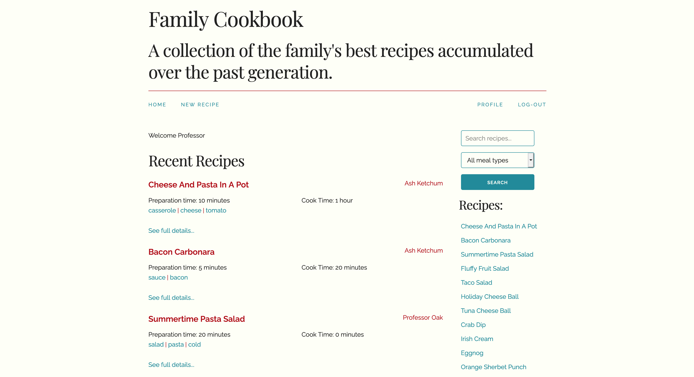

# Cookbook Content Management System
This is a sample PHP application that allows users to sign in to create and edit their recipes.
# Demo
The [demo for my Family Cookbook](https://cookbook-ds.herokuapp.com/) is up and running. You can sign up but I've revoked the ability to create new recipes.
You may need to wait up to 30 seconds for the server to wake up.

# Screenshots
## The Home Page

## A Recipe Page

## The Edit Recipe Page

## A Profile Page

